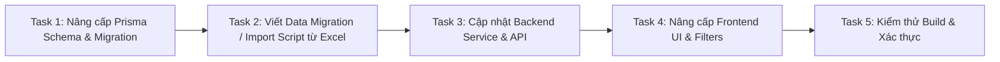

# Kế hoạch Triển khai: Chuẩn hóa Toàn bộ Danh mục MMTB & Hồ sơ Đội xe (KLH Koun Mom)

Kế hoạch này được xây dựng dựa trên kết quả đọc & phân tích 20 sheets dữ liệu thực tế từ file [00. DANH MỤC MMTB THUỘC KLH KOUN MOM.xlsx](file:///d:/ThacoAgri_Code/Mockup/docs/00.%20DANH%20M%E1%BB%A4C%20MMTB%20THU%E1%BB%98C%20KLH%20KOUN%20MOM.xlsx) và các quyết định bạn đã xác nhận:
- **Phạm vi (Phương án B)**: Quản lý toàn bộ danh mục MMTB (Xe cơ giới, máy công trình, máy nông nghiệp, nông cụ, máy phát điện, máy phát cỏ, xe máy 2 bánh...).
- **Quy tắc Sheet nguồn**: Lấy sheet `TỔNG KLH + TN` (3.147 dòng) làm Master Index, kết hợp đối chiếu mã Bravo/Kế toán từ `02.1 NHÓM XE & MÁY` và thông số bàn giao từ `XE & MÁY CG AGRI`.
- **GPS**: Chưa gán lên xe (để trống/optional, sẵn sàng gán sau).
- **Phân loại xe**: Bao quát đầy đủ 3 nhóm chính (Máy công trình, Máy nông nghiệp, Xe vận tải & công vụ) + các nhóm máy móc/thiết bị phụ trợ.
- **Cơ cấu tổ chức**: Chuẩn hóa 3 cấp (KLH -> Khu vực DP/LP/AD -> Xí nghiệp/Đội trực thuộc).

---

## Danh sách các Task thực hiện tuần tự

---

### Task 1: Thiết kế & Mở rộng Prisma Schema (`backend/prisma/schema.prisma`)
1. Mở rộng enum `VehicleCategory` và `VehicleGroup` hỗ trợ đầy đủ các nhóm thực tế:
   - **Nhóm 1 - Máy công trình**: `MAY_DAO`, `MAY_UI`, `MAY_SAN`, `MAY_LU`, `MAY_XUC_LAT`.
   - **Nhóm 2 - Máy nông nghiệp**: `MAY_KEO`, `MAY_GAT_DAP`.
   - **Nhóm 3 - Xe vận tải & Công vụ**: `XE_TAI`, `XE_BEN`, `XE_BON`, `XE_CONTAINER`, `XE_BAN_TAI`, `XE_CHUYEN_DUNG`.
   - **Nhóm 4 - Máy móc & Thiết bị phụ trợ**: `MAY_PHAT_DIEN`, `MAY_PHAT_CO`, `MAY_CUA`, `MAY_BOM`, `XE_MAY_2_BANH`, `THIET_BI_NONG_CU`.
2. Mở rộng Model `Vehicle`:
   - Thêm các trường kế toán & kỹ thuật: `bravoCode`, `assetCode`, `modelName`, `manufacturer`, `origin`, `manufactureYear`, `engineNumber` (số máy), `frameNumber` (số khung), `powerHp`, `fuelQuotaRate`, `fuelQuotaUnit` (`L_PER_HOUR`, `L_PER_KM`, `L_PER_HA`), `contractStatus`, `companyOwner`, `regionCode`.
   - Các trường GPS (`gpsImei`, `fuelSensorImei`) cho phép `NULL` (chưa gán).
3. Chuẩn hóa Model `CatalogItem` cho 3 cấp đơn vị:
   - Cấp 1 (`COMPLEX`): KLH Koun Mom.
   - Cấp 2 (`REGION` / `DEPARTMENT`): Daun Penh, Lumphat, Andong Meas.
   - Cấp 3 (`ENTERPRISE` / `FARM` / `TEAM`): XN Chuối DP1-DP4, XN Chuối LP1-LP2, XN Bò AD, Cơ giới thi công, Cơ giới làm đất...
4. Chạy `npx prisma db push` hoặc migration để cập nhật database MySQL.

---

### Task 2: Xây dựng Kịch bản Import Dữ liệu Chuẩn từ File Excel (`backend/prisma/import_mmtb.ts`)
1. Viết script ETL (Extract - Transform - Load) đọc trực tiếp từ `docs/00. DANH MỤC MMTB THUỘC KLH KOUN MOM.xlsx`.
2. Hợp nhất (enrich) dữ liệu giữa các sheet:
   - Lấy toàn bộ 3.147+ dòng từ sheet `TỔNG KLH + TN`.
   - Bổ sung `Mã Bravo` và `Mã tài sản` từ `02.1 NHÓM XE & MÁY`.
   - Bổ sung ngày tiếp nhận, xuất xứ, công ty sở hữu từ `XE & MÁY CG AGRI`.
   - Bổ sung thông tin đăng kiểm định kỳ từ `08. ĐKĐK`.
3. Tự động khởi tạo cây 3 cấp đơn vị và nạp toàn bộ danh mục phương tiện vào database với tính idempotent (không bị trùng lặp khi chạy lại).

---

### Task 3: Cập nhật Backend DTOs & Services (`backend/src/vehicles/`, `backend/src/catalogs/`)
1. Cập nhật `VehicleResponseDto`, `CreateVehicleDto`, `UpdateVehicleDto`, `VehicleFilterDto`.
2. Hỗ trợ tìm kiếm theo nhiều loại mã (`code`, `bravoCode`, `assetCode`, `plate`, `frameNumber`).
3. Hỗ trợ lọc đa cấp: theo Nhóm xe, Chủng loại xe, Cấp khu vực (DP, LP, AD), Xí nghiệp/Đội cụ thể.

---

### Task 4: Nâng cấp Frontend UI & Bộ lọc (`frontend/src/`)
1. Cập nhật Typescript interfaces tại `frontend/src/types/index.ts`.
2. Nâng cấp màn hình Hồ sơ xe `frontend/src/pages/fleet/VehiclesPage.tsx`:
   - Bộ lọc 3 cấp: Khu liên hợp -> Khu vực -> Xí nghiệp/Đội.
   - Bộ lọc nhóm chủng loại (Máy công trình, Máy nông nghiệp, Xe vận tải, Máy phụ trợ).
   - Hiển thị đầy đủ thông tin: Mã MMTB mới, Mã Bravo, Mã kế toán, Định mức nhiên liệu linh hoạt theo đơn vị (`L/h`, `L/100km`, `L/ha`).
   - Modal chi tiết hồ sơ xe hiển thị đầy đủ thông tin số khung, số máy, xuất xứ, năm sản xuất, tình trạng đăng kiểm.
3. Nâng cấp màn hình Danh mục MMTB tại `frontend/src/pages/master-data/ProjectCatalogsDashboardPage.tsx` và `CommonCatalogsPage.tsx`.

---

### Task 5: Kiểm thử Build & Xác thực Dữ liệu (Quality Gates)
1. Build backend (`npm run build` trong `backend`).
2. Build frontend (`npm run build` trong `frontend`).
3. Kiểm tra số lượng bản ghi sau import khớp với file Excel (3.147+ thiết bị).
4. Kiểm tra các luồng tra cứu, tìm kiếm, lọc dữ liệu trên giao diện web.

---

## Kế hoạch triển khai: Thực hiện **Task 1** trước tiên

Tôi sẽ bắt đầu với **Task 1: Thiết kế & Nâng cấp Prisma Schema** ngay khi bạn xác nhận duyệt kế hoạch này.
